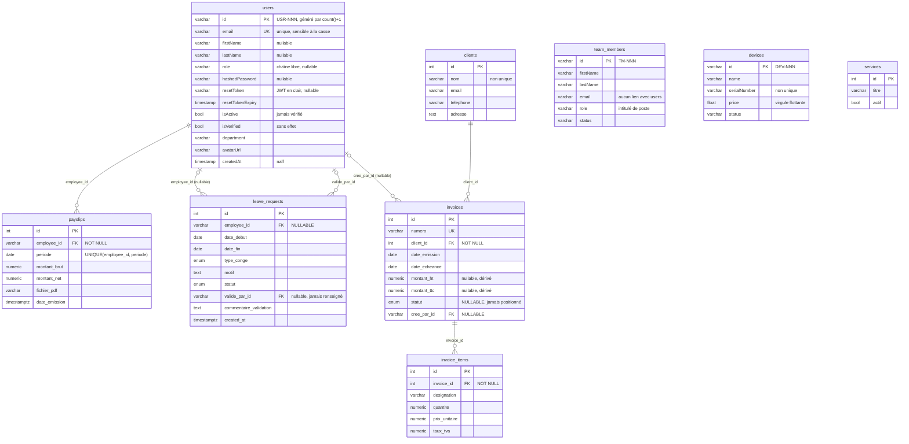

# Phase 4 — Relations et ERD logique

> 2026-10-01 · `develop` @ `34453a4`
>
> ERD construit **à partir des modèles ORM**. Il n'existait aucun diagramme
> dans le dépôt : `docs/DOCUMENTATION.MD` n'en contient pas, et décrit
> l'ancien backend JSON.
>
> Les comportements `ON DELETE` / `ON UPDATE` effectifs, et l'existence réelle
> des FK en base, sont `NOT VERIFIED` jusqu'à l'exécution de Q-SCH-004.

## 1. ERD de l'état actuel

`team_members`, `devices` et `services` sont des **îlots** : aucune relation
n'entre ni ne sort de ces tables.

## 2. Analyse relation par relation

Légende :
- **Cardinalité :** côté parent → côté enfant.
- **Optionalité :** l'enfant peut-il exister sans parent ?
- **Orphelins :** risque que des lignes enfants perdent leur parent.
- **Suppression :** que se passe-t-il quand on supprime le parent ?
- **ORM :** relation déclarée côté SQLAlchemy.

| # | Relation | Cardinalité | Optionalité | `ON DELETE` attendu (modèle) | Orphelins | Suppression accidentelle | ORM | Constat |
|---|---|---|---|---|---|---|---|---|
| R1 | `users` → `payslips.employee_id` | 1 → 0..N | obligatoire | `NO ACTION` | aucun si la FK existe | supprimer un employé est **bloqué** dès qu'il a un bulletin. C'est souhaitable : la paie doit être conservée. | ❌ aucune `relationship()` | Bonne cardinalité. L'unicité `(employee_id, periode)` empêche deux bulletins pour un même mois, ce qui est correct. Mais **l'employé est un `users.id`** : la paie dépend du compte de connexion, pas d'une fiche employé. |
| R2 | `users` → `leave_requests.employee_id` | 1 → 0..N | **optionnelle** (nullable) | `NO ACTION` | **un congé sans employé est permis** | bloquée si l'employé a des congés | ❌ | 🔴 Une demande de congé sans demandeur n'a pas de sens métier. Le nullable est une erreur de modélisation. |
| R3 | `users` → `leave_requests.valide_par_id` | 1 → 0..N | optionnelle | `NO ACTION` | — | supprimer un valideur est bloqué | ❌ | La relation est correcte, mais **aucun code actif ne la renseigne** : l'auteur d'une décision n'est jamais tracé. Aucune règle n'empêche non plus `valide_par_id = employee_id`, soit l'auto-validation. |
| R4 | `users` → `invoices.cree_par_id` | 1 → 0..N | **optionnelle**, volontairement (`invoicing.py:45`) | `NO ACTION` | permis | bloquée | ❌ | 🔴 Une facture sans auteur empêche toute traçabilité comptable. `insert_invoices.py:120` insère explicitement `None`. |
| R5 | `clients` → `invoices.client_id` | 1 → 0..N | obligatoire | `NO ACTION` | aucun | supprimer un client facturé est bloqué, ce qui est correct. Mais aucun endpoint de suppression n'existe. | ✅ bidirectionnelle (`Client.invoices` ↔ `Invoice.client`) | Relation saine. **Le nom d'un client n'est pas unique** : deux fiches « Acme Corp » sont possibles (Q-INT-020). |
| R6 | `invoices` → `invoice_items.invoice_id` | 1 → 0..N | obligatoire | `NO ACTION` en base / **cascade côté ORM** | aucun | comportement **différent selon le chemin** : l'ORM supprime les lignes, le SQL direct refuse | ✅ `Invoice.items`, `cascade="all, delete-orphan"` | Une facture **sans aucune ligne** est permise (`0..N`) : l'en-tête existe alors avec un montant de 0. La cardinalité métier attendue est `1..N`. |

### Relations attendues par le métier, mais absentes

| # | Relation manquante | Preuve qu'elle est attendue | Conséquence |
|---|---|---|---|
| M1 | `invoices` ↔ `devices` (N..N, ou 1..N si un appareil n'est vendu qu'une fois) | ticket #18 fermé, `InvoiceCreate.deviceIds` (`main.py:168`), passage au statut « Sold » (`main.py:416-420`) | Impossible de savoir quel appareil a été vendu sur quelle facture. Le statut « Sold » n'est rattaché à rien. |
| M2 | `team_members` → `users` (1..1) | mêmes attributs dans les deux tables | Deux sources de vérité pour l'identité d'une personne (OBS-026). |
| M3 | `users` → fiche employé (1..1) | `User.employee_profile` utilisé par les routers morts (`routers/leaves.py:17`, `payroll.py:18`), `EmployeeOut` (`schemas/user.py:33-41`, avec `poste`, `date_embauche` et `solde_conges`) | Le modèle « employé » prévu n'a jamais été créé. Paie et congés sont rattachés au **compte**, et le solde de congés n'est stocké nulle part. |
| M4 | `invoices` → décision d'approbation (valideur, date, motif) | besoin central de la comptable | Aucune trace possible de « qui a approuvé quoi, quand ». |
| M5 | `projects` ↔ `users` / `team_members` (N..N) | `Project.teamMembers: string[]` (`types.ts:73`) | L'entité n'existe que dans le navigateur. |
| M6 | `notifications` → `users` | `Notification.targetRole` (`App.tsx:43`) | Les notifications ne visent qu'un rôle, jamais une personne, et ne sont pas persistées côté serveur. |

### Types de relations recherchés par la mission

| Type | Présent ? |
|---|---|
| one-to-one | ❌ aucun ; M2 et M3 devraient l'être |
| one-to-many | ✅ R1 à R6 |
| many-to-many / table pivot | ❌ aucun ; M1 et M5 devraient l'être |
| auto-référence | ❌ aucune. Par exemple, aucun lien employé → manager : le valideur d'un congé n'est donc pas « son » responsable. |
| polymorphique | ❌ aucune |

## 3. Cohérence ORM ↔ base pour les relations

| Point | État |
|---|---|
| FK déclarées dans les modèles | 6 (R1 à R6) |
| FK réellement présentes en base | `NOT VERIFIED` (Q-SCH-004). Vraisemblablement 6, puisque `create_all()` a été lancé sur ces modèles le 2026-10-01. |
| `relationship()` déclarées | 2 paires (R5, R6) sur 6 FK |
| FK sans `relationship()` | R1, R2, R3, R4 : `User` n'a aucune relation inverse |
| Index sur les colonnes de FK | **aucun déclaré** (Q-SCH-007) |
| `ondelete` / `onupdate` explicites | **aucun** |
| `ON UPDATE` | sans objet en pratique, sauf pour `users.id` : c'est une chaîne métier (`USR-NNN`) que rien n'empêche de renommer. Avec `NO ACTION`, ce renommage serait refusé dès qu'une ligne la référence. |

## 4. Évaluation

Les relations **qui existent** sont, pour la plupart, correctement orientées et
de la bonne cardinalité (R1, R5, R6).

Les défauts sont de trois ordres :
1. **Optionalité erronée** sur des liens obligatoires pour le métier : R2 et R4.
2. **Relations absentes** là où le métier en a besoin : M1 à M4. En particulier,
   il n'existe aucune entité employé distincte du compte, et aucune trace
   d'approbation.
3. **Comportement de suppression implicite** : `NO ACTION` partout, et une
   cascade qui n'existe que dans l'ORM (R6).

**Il n'y a pas de risque d'orphelins tant que les FK existent.** Le risque se
situe dans ce qui **n'est pas** relié : `team_members` et `devices`, ainsi que
les colonnes nullables R2 et R4.
