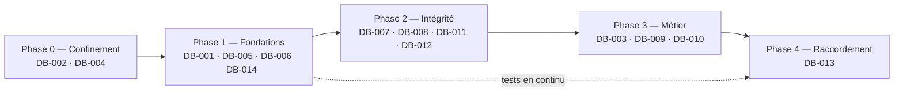

# Plan de remédiation

> 2026-10-02 · construit à partir des 24 findings de `10-findings/`.
>
> L'ordre est imposé par les **dépendances techniques**, et pas seulement par la
> sévérité. Trois exemples :
> - corriger les noms de colonnes des congés **avant** d'avoir protégé la route
>   rendrait l'approbation anonyme effective (AUDIT-DB-002 / 013) ;
> - ajouter des contraintes sans migrations impose de les appliquer à la main sur
>   chaque base (AUDIT-DB-015) ;
> - brancher l'interface sur l'API actuelle reproduirait les défauts prouvés
>   (AUDIT-DB-001 / 013).

## Vue d'ensemble

Les identifiants `DB-NNN` du schéma sont ceux des tickets (`TICKET-DB-NNN`,
dans `13-tickets/`).

## Phase 0 — Confinement (immédiat, quelques jours)

**But :** fermer ce qui est exploitable aujourd'hui, sans attendre la refonte.

| Ticket | Findings | Pourquoi maintenant |
|---|---|---|
| **TICKET-DB-002** — Authentification et autorisation sur chaque route ; suppression de `/api/data` | 002 **CRITICAL**, 003, 020 | écriture anonyme confirmée ; données comptables lisibles par tout employé |
| **TICKET-DB-004** — Secrets, rôle PostgreSQL à privilèges minimaux, journalisation sûre | 006, 007, 008, 021 | clé JWT de repli et mot de passe de la base dans le dépôt ; superutilisateur ; hash de mots de passe dans les logs |

Ces deux tickets ne dépendent d'aucune refonte. Le frontend n'appelle aucune des
routes touchées (AUDIT-DB-001), donc il n'y a pas de régression visible.

**Action hors code, à faire tout de suite :**
- changer le mot de passe du rôle `postgres` de tout environnement qui
  utiliserait la valeur du dépôt ;
- changer les mots de passe des 3 comptes présents dans `db.json`.

## Phase 1 — Fondations

| Ticket | Findings | Rôle |
|---|---|---|
| **TICKET-DB-001** — Migration de référence Alembic | 015 | **prérequis** de toute évolution du schéma |
| **TICKET-DB-014** — Tests d'API, `Dockerfile`, modèle d'environnement, documentation | 022 | les tests d'autorisation doivent exister **avant** les refontes, pour les sécuriser |
| **TICKET-DB-005** — Unifier le modèle de données (ticket #37) | 013, 019 | décision de vocabulaire, puis réécriture des routes sur les modèles et suppression du code mort |
| **TICKET-DB-006** — Identifiants générés par la base ; numérotation des factures | 012 | débloque la création de compte ; fiabilise la numérotation (#38, #39) |

## Phase 2 — Intégrité

| Ticket | Findings | Rôle |
|---|---|---|
| **TICKET-DB-007** — Contraintes d'intégrité métier | 014 | les 26 sondes acceptées deviennent des refus |
| **TICKET-DB-008** — Corriger la création de facture | 010 | réservée à l'admin ; statut initial ; plus de doublon |
| **TICKET-DB-011** — Compléter le modèle : fiche employé, lien appareil ↔ facture, politique `ON DELETE` | 016 | **décisions métier** préalables |
| **TICKET-DB-012** — Index et schémas de requêtes | 018 | **avant** le circuit comptable |

## Phase 3 — Fonctionnalités métier

| Ticket | Findings | Rôle |
|---|---|---|
| **TICKET-DB-003** — Cycle de vie des comptes | 004, 005, 009, 024 | désactivation effective, révocation des sessions, jetons de réinitialisation sûrs, activation par lien |
| **TICKET-DB-010** — Journal d'audit | 017 | requis par le circuit comptable |
| **TICKET-DB-009** — Circuit comptable | 011 | approbation, notifications, filtres (#40, #41, #42) |

## Phase 4 — Raccordement de l'interface

| Ticket | Findings | Rôle |
|---|---|---|
| **TICKET-DB-013** — Faire de l'API la source de vérité de l'interface | 001, 023 | raccordement entité par entité, en commençant par les factures |

## Décisions métier nécessaires

Ces décisions sont nécessaires avant les phases 2 et 3. L'audit ne peut pas les
prendre.

| Sujet | Question | Bloque |
|---|---|---|
| Ticket #37 | Quel vocabulaire unique pour le schéma et l'API ? | TICKET-DB-005 et tout ce qui suit |
| R-FAC-01 | La création de factures est-elle réservée à l'admin ? | TICKET-DB-008 |
| R-FAC-02, 06, 07 | États d'une facture, transitions, modification après émission, annulation ou avoir ? | TICKET-DB-009 |
| R-USR-05 | Un compte par personne ? | TICKET-DB-007 (unicité de l'e-mail sans casse) |
| R-CNG-04, 06 | Une décision de congé est-elle révisable ? Les chevauchements sont-ils interdits ? | TICKET-DB-007 |
| R-PAY-03, 04 | Qui émet les bulletins ? L'admin les consulte-t-il ? | TICKET-DB-005, 011 |
| Entité employé | Créer `employees` distincte de `users` ? | TICKET-DB-011 |
| Rôle `rh` | L'ajouter, ou le retirer du code ? | TICKET-DB-007 |

## Ce qu'il ne faut pas faire

- **Brancher l'interface sur l'API actuelle** avant les phases 1 et 2.
- **Supprimer physiquement des comptes** : la paie référence `users`.
  Désactiver à la place (TICKET-DB-003).
- **Renuméroter les identifiants ou les factures existants.** Reprendre les
  séquences au maximum existant.
- **Corriger les noms de champs des congés** (TICKET-DB-005) **avant**
  TICKET-DB-002.

## Données de test laissées par l'audit

Ces données sont en base locale et marquées `AUDIT-TEST`. Elles n'ont **pas**
été supprimées, conformément aux règles de l'audit :
- 3 comptes (`USR-008`, `009`, `010`) ;
- 1 client ;
- 2 factures (`FA-2026-0001`, `0002`, statut NULL) et leurs lignes ;
- 1 membre d'équipe (`TM-00001`) ;
- 1 demande de congé (id 7).

Elles devront être **nettoyées avant d'appliquer les contraintes `NOT NULL`**
de TICKET-DB-007, puisque les factures ont un statut NULL. Ce nettoyage demande
une autorisation explicite.
