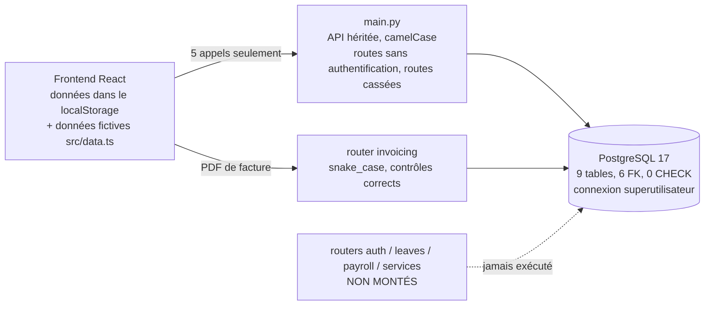

# Rapport final — Audit de la couche données de DI Xpertia

> **Période :** 2026-10-01 → 2026-10-02
> **Code audité :** branche `develop`, commit `34453a4`
> **Base auditée :** PostgreSQL 17.11 local, base `dixpertia`
> **Statut :** audit **terminé** ; 24 findings confirmées ; 14 tickets rédigés (non publiés)

---

## Executive Summary

La question posée était :

> « La couche données actuelle de DI Xpertia est-elle correctement conçue,
> cohérente avec le métier, sécurisée, intègre et suffisamment robuste pour
> continuer le développement de la plateforme ? »

**Réponse : non, pas en l'état. Mais elle est réparable, et le moment est
favorable pour le faire.**

L'audit établit, preuves à l'appui, quatre faits principaux :

1. **La base n'est pas utilisée par l'application.** L'interface ne lit et
   n'écrit en base que pour la connexion et la création de compte. Toutes les
   données métier vivent dans le navigateur, à partir de données fictives.
2. **L'API qui devrait alimenter l'interface n'est pas en état de le faire.**
   - Des routes acceptent des écritures **sans authentification** (CRITICAL).
   - Un employé lit la comptabilité et la liste du personnel.
   - Plusieurs routes plantent à chaque appel, et la création de compte échoue
     systématiquement.
   - L'approbation d'un congé répond « succès » sans rien écrire.
3. **La base ne garantit que l'intégrité référentielle.** Sur 26 règles métier
   testées, **aucune** n'est imposée : montants négatifs, échéance antérieure à
   l'émission, deux bulletins pour le même mois, rôle `superadmin`…
4. **Le besoin central de la comptable n'est pas modélisé** : ni approbation,
   ni notification, ni filtres.

**Pourquoi le moment est favorable :**
- les tables sont quasi vides, donc les migrations se feront sans reprise de
  données ;
- les défauts n'ont pas encore produit de dégâts, puisque l'interface
  n'utilise pas l'API ;
- les fondations saines existent : les clés étrangères fonctionnent, il n'y a
  pas de SQL brut, les mots de passe sont en bcrypt, et le router des factures
  applique correctement ses contrôles.

**Recommandation :** ne pas brancher l'interface sur l'API, et ne pas construire
le circuit comptable, avant d'avoir traité les phases 0 à 2 du plan de
remédiation.

---

## Scope

| Inclus | Exclu, ou non vérifiable |
|---|---|
| Backend complet : `main.py`, `app/`, scripts de données | Base de production : **aucune n'est accessible**. Les constats sur les données réelles sont `NOT VERIFIED`. |
| Frontend, en tant que consommateur de données (`src/`) | Sécurité du frontend au-delà des données (XSS, dépendances npm) |
| Schéma réel : catalogue PostgreSQL complet | Exécution du `Dockerfile` (Docker absent du poste) |
| Intégrité : données existantes **et** contraintes, par sondage | Charge réelle : tables vides, donc aucune mesure de temps significative |
| Accès et permissions, testés à l'exécution par rôle | Reproduction effective des scénarios de concurrence (analysés dans le code) |
| Performance : index, plans d'exécution, schémas de requêtes | — |
| Transactions, concurrence, règles métier | — |

### Méthode et garanties
- **Aucune modification** du code ni du schéma.
- Requêtes de catalogue en **lecture seule, imposée par le serveur**
  (`default_transaction_read_only`).
- Sondes d'écriture dans des **transactions toujours annulées**, avec
  vérification de 0 ligne résiduelle.
- Écritures de test **autorisées** en base locale, marquées `AUDIT-TEST`.
  **Rien n'a été supprimé.**
- **Aucun secret reproduit** dans les preuves : masquage systématique.

---

## Architecture

- Stack : FastAPI 0.111, SQLAlchemy 2.0, Alembic 1.13 (aucune migration),
  PostgreSQL 17, React 19, Vite 6.
- Authentification : JWT HS256 sur 60 minutes, en **deux implémentations**
  parallèles.
- Autorisation : comparaison de chaînes de rôle, endpoint par endpoint. Il n'y
  a pas de notion de permission.

Détails : `02-discovery/`.

---

## Database Inventory

| Table | Rôle | PK | FK sortantes | Lignes avant l'audit |
|---|---|---|---|---|
| `users` | comptes | VARCHAR `USR-NNN`, générée par l'application | — | 4 |
| `payslips` | bulletins de paie | INTEGER | → `users` | 0 |
| `leave_requests` | demandes de congé | INTEGER | → `users` ×2 | 0 |
| `clients` | clients | INTEGER | — | 0 |
| `invoices` | factures | INTEGER (+ `numero` UNIQUE) | → `clients`, → `users` | 0 |
| `invoice_items` | lignes de facture | INTEGER | → `invoices` | 0 |
| `team_members` | annuaire | VARCHAR `TM-NNNNN` | — (**isolée**) | 0 |
| `devices` | appareils | VARCHAR `DEV-NNN` | — (**isolée**) | 0 |
| `services` | services du site vitrine | INTEGER | — (**isolée**, jamais utilisée) | 0 |

**Totaux :**
- 71 colonnes, dont 14 en camelCase ;
- 6 FK, toutes en `NO ACTION` ;
- 3 unicités métier ;
- **0 CHECK** ;
- 21 index, dont **9 redondants** ;
- 3 ENUM, qui stockent les noms et non les valeurs ;
- 0 RLS, 0 trigger, 0 migration.

**Entités absentes du schéma, bien que présentes dans le produit ou attendues
par le métier :**
- fiche employé ;
- approbation de facture ;
- notifications ;
- projets ;
- demandes de documents ;
- journal d'audit ;
- lien appareil ↔ facture.

Détails : `02-discovery/database-overview.md`, `04-models/orm-vs-database.md`.

---

## Relationship Analysis

- **Les relations existantes sont saines dans leur orientation et leur
  cardinalité** : paie → employé, facture → client, ligne → facture. Les 4 FK
  testées rejettent correctement les orphelins et les suppressions dangereuses.
- **Deux relations ont une optionalité erronée** : un congé sans employé, une
  facture sans auteur.
- **La cascade des lignes de facture n'existe que dans l'ORM.** Une suppression
  SQL directe est refusée, alors qu'une suppression par l'ORM supprime les
  lignes.
- **Six relations attendues par le métier sont absentes**, dont la plus
  structurante : il n'existe pas d'entité employé distincte du compte de
  connexion.
- **5 FK sur 6 ne sont pas indexées.**

Détails et ERD : `05-relations/relations-and-erd.md`.

---

## ORM / Database Consistency

| Comparaison | Résultat |
|---|---|
| **ORM ↔ schéma réel** | conformes, ce qui est attendu puisque le schéma a été créé par `create_all()`. La divergence porte sur les **valeurs par défaut, présentes côté Python seulement** : toute écriture hors ORM produit des NULL, dont `isActive`. |
| **ORM ↔ migrations** | **aucune migration**, aucune table `alembic_version` |
| **ORM ↔ API** | 🔴 **incompatibles** pour les congés, les factures et les bulletins. Une seule entité sur 11 est cohérente de bout en bout. Preuves à l'exécution : `TypeError` à la création de congé ; `'User' object is not subscriptable` sur tous les appareils ; écriture de congé sans effet ; `ResponseValidationError` sur le statut des factures. |
| **API ↔ frontend** | 🔴 l'interface n'utilise pas l'API pour les données métier |

Détails : `04-models/`.

---

## Data Integrity

- **Données existantes** : saines, mais non probantes, puisque 8 tables sur 9
  sont vides. Une anomalie a quand même été prouvée : le prochain identifiant
  utilisateur que l'API générera **existe déjà**.
- **Contraintes** : **26 écritures invalides sur 30 acceptées.** Les 4 refus
  correspondent aux 4 contraintes existantes. Aucune règle métier testée n'est
  garantie par la base.
- **Constat nouveau** : l'unicité de la paie porte sur une date et non sur un
  mois, si bien que deux bulletins pour le même mois sont acceptés.
- **Concurrence** : aucun verrou, aucun rollback explicite. Sept générateurs
  d'identifiant ou de numéro reposent sur `count() + 1`. Une seule opération est
  correctement atomique : la facture créée avec ses lignes.

Détails : `08-data-integrity/`.

---

## Security

| Constat | Sévérité | Preuve |
|---|---|---|
| Écriture anonyme : membres d'équipe, création et décision de congés | **CRITICAL** | T-B08 (201 sans jeton), T-B09 (200 sans jeton) |
| `/api/data` : un employé lit tous les comptes, les factures et les congés | HIGH | T-B01, T-B07 |
| Un compte désactivé se connecte ; la suppression d'un compte dans l'UI est locale | HIGH | T-B04 ; code |
| L'application est superutilisateur PostgreSQL (`bypassrls`) | HIGH | Q-DISC-003, Q-SEC-002 |
| Clé JWT de repli et mot de passe de la base dans le dépôt ; hash réels dans `db.json` | HIGH | `git grep` (valeurs masquées) ; T-A08 |
| Un jeton de réinitialisation sert de jeton de session ; il est stocké en clair | MEDIUM | T-B07 |
| Hash de mot de passe et e-mail dans les logs à chaque création de compte | MEDIUM | log du backend, ligne 434 |
| Énumération des comptes par le temps de réponse (24 ms contre 292 ms) | LOW | T-A09 |

**Contrôles efficaces, confirmés :**
- le router des factures refuse l'employé (T-B02, T-B03, T-B06) ;
- les secrets sont retirés des réponses (T-A06) ;
- le rôle est relu en base à chaque requête ;
- il n'y a aucun SQL brut ;
- bcrypt est utilisé ;
- `scram-sha-256`, et `pg_hba` restreint à localhost.

Détails : `06-security/`.

---

## Performance

**Aucun problème n'est mesurable aujourd'hui**, faute de volume. En revanche,
il est structurellement prouvé qu'**aucun index n'est utilisable** pour :
- le tri des factures par date ;
- les filtres par client et par mois ;
- le chargement des lignes d'une facture.

Il faut ajouter que :
- l'index de `numero` ne sert pas à la numérotation, à cause de la collation
  non-C ;
- 9 index sont redondants ;
- la liste des factures fait 1 + N requêtes ;
- `/api/data` lit 6 tables entières ;
- aucune liste n'est paginée.

Détails : `07-performance/`.

---

## Business Rules

36 règles évaluées :
- **6 seulement sont protégées côté serveur** ;
- **15 sont enfreignables** par un appel direct à l'API ;
- **5 fonctionnalités sont absentes** ;
- **10 sont simulées par l'interface** sans effet réel.

Les plus lourdes de conséquences :
- **la révocation d'accès est illusoire** ;
- **le circuit comptable n'existe pas** ;
- **la séparation des responsabilités est inversée** : la comptable peut créer
  des factures ;
- **les arbitrages des tickets #10, #12 et #47 n'existent que dans
  l'interface**.

Sept règles doivent être précisées par le métier avant la remédiation.

Détails : `09-business-rules/business-rules-matrix.md`.

---

## Findings

| ID | Severity | Category | Finding | Status |
|---|---|---|---|---|
| AUDIT-DB-002 | CRITICAL | Sécurité | Endpoints d'écriture accessibles sans authentification | OPEN |
| AUDIT-DB-001 | HIGH | Architecture | La base n'est pas la source de vérité de l'application | OPEN |
| AUDIT-DB-003 | HIGH | Sécurité | `/api/data` expose toutes les données à tout utilisateur connecté | OPEN |
| AUDIT-DB-004 | HIGH | Sécurité | Révocation d'accès inopérante | OPEN |
| AUDIT-DB-006 | HIGH | Sécurité | Connexion en superutilisateur PostgreSQL | OPEN |
| AUDIT-DB-007 | HIGH | Sécurité | Secrets dans le dépôt | OPEN |
| AUDIT-DB-010 | HIGH | Intégrité / Métier | Création de facture : rôle, statut, doublons | OPEN |
| AUDIT-DB-011 | HIGH | Métier | Circuit comptable absent | OPEN |
| AUDIT-DB-012 | HIGH | Intégrité | Identifiants par `count()+1` ; création de compte cassée | OPEN |
| AUDIT-DB-013 | HIGH | Architecture | Modèle scindé API ↔ ORM ; routes cassées ; code mort | OPEN |
| AUDIT-DB-014 | HIGH | Intégrité | Aucune contrainte métier en base | OPEN |
| AUDIT-DB-005 | MEDIUM | Sécurité | Jeton de réinitialisation accepté en session, stocké en clair | OPEN |
| AUDIT-DB-008 | MEDIUM | Sécurité | Données sensibles dans les logs | OPEN |
| AUDIT-DB-015 | MEDIUM | Architecture | Aucune migration | OPEN |
| AUDIT-DB-016 | MEDIUM | Modèle | Entités et relations manquantes | OPEN |
| AUDIT-DB-017 | MEDIUM | Conformité | Aucune traçabilité | OPEN |
| AUDIT-DB-009 | LOW | Sécurité | Énumération des comptes par le temps de réponse | OPEN |
| AUDIT-DB-018 | LOW | Performance | Index manquants ou redondants ; N+1 ; pas de pagination | OPEN |
| AUDIT-DB-019 | LOW | Modèle | Rôles non modélisés ; représentation hétérogène des valeurs | OPEN |
| AUDIT-DB-020 | LOW | Sécurité | Sérialisation par liste d'exclusion | OPEN |
| AUDIT-DB-021 | LOW | Exploitation | Configuration du serveur PostgreSQL | OPEN |
| AUDIT-DB-022 | LOW | Maintenabilité | Aucun test ; `Dockerfile` cassé ; documentation obsolète | OPEN |
| AUDIT-DB-023 | LOW | Interface | Bascule « vue admin » offerte à tous ; jeton dans le `localStorage` | OPEN |
| AUDIT-DB-024 | LOW | Sécurité | Mot de passe provisoire dans la réponse | OPEN |

**Total : 1 CRITICAL · 10 HIGH · 5 MEDIUM · 8 LOW · 0 INFO.** Chaque fiche,
dans `10-findings/`, justifie sa sévérité et cite ses preuves.

---

## Recommended Remediation

| Phase | Objectif | Tickets |
|---|---|---|
| **0 — Confinement**, immédiat | fermer ce qui est exploitable aujourd'hui | DB-002 (critique), DB-004. **Et, hors code :** rotation du mot de passe `postgres` et des 3 comptes de `db.json`. |
| **1 — Fondations** | rendre les corrections livrables et vérifiables | DB-001 (migrations), DB-014 (tests), DB-005 (modèle unifié, #37), DB-006 (identifiants) |
| **2 — Intégrité** | faire de la base le dernier rempart | DB-007 (contraintes), DB-008 (factures), DB-011 (modèle), DB-012 (index) |
| **3 — Métier** | construire ce qui manque | DB-003 (comptes), DB-010 (audit), DB-009 (circuit comptable) |
| **4 — Raccordement** | faire de l'API la source de vérité de l'interface | DB-013 |

**Contrainte d'ordonnancement critique :** corriger les noms de colonnes des
congés (DB-005) **avant** de protéger les routes (DB-002) rendrait
l'approbation anonyme **effective**.

Plan détaillé, décisions métier nécessaires et pièges à éviter :
`12-recommendations/remediation-plan.md`.

---

## Tickets Created

14 tickets de remédiation et 1 ticket parent, rédigés **en anglais** dans
`13-tickets/`. Ils sont publiés sur GitHub après le merge de ce dossier, pour
pouvoir citer les preuves par lien permanent, conformément à la décision de ne
publier qu'après la vérification complète.

| Ticket | Titre | Findings |
|---|---|---|
| TICKET-DB-000 | [AUDIT] End-to-End Database & Data Architecture Audit (parent) | toutes |
| TICKET-DB-001 | Alembic baseline migration | 015 |
| TICKET-DB-002 | Require authentication on every route, enforce roles, remove `/api/data` | 002, 003, 020 |
| TICKET-DB-003 | Server-side account lifecycle | 004, 005, 009, 024 |
| TICKET-DB-004 | Secrets, least-privilege DB role, safe logging | 006, 007, 008, 021 |
| TICKET-DB-005 | Unify the data model (#37) | 013, 019 |
| TICKET-DB-006 | DB-generated ids, reliable invoice numbering | 012 |
| TICKET-DB-007 | Integrity constraints | 014 |
| TICKET-DB-008 | Fix invoice creation | 010 |
| TICKET-DB-009 | Accountant workflow | 011 |
| TICKET-DB-010 | Audit trail | 017 |
| TICKET-DB-011 | Complete the data model | 016 |
| TICKET-DB-012 | Indexes and query patterns | 018 |
| TICKET-DB-013 | API as the UI's source of truth | 001, 023 |
| TICKET-DB-014 | Tests, Dockerfile, `.env.example`, docs | 022 |

Trois tickets recoupent des issues existantes, et doivent leur être
**rattachés** et non dupliqués : DB-005 ↔ #37, DB-006 ↔ #38/#39, DB-004 ↔ #43.

---

## Remaining Risks

| Risque | Pourquoi il reste |
|---|---|
| **État d'une éventuelle base de production** | non accessible. Son schéma peut différer, puisqu'il n'y a pas de migrations. Ses données peuvent contenir les anomalies que la base locale, vide, ne pouvait pas révéler. Il faut rejouer les 69 requêtes et le sondage sur toute base réelle. |
| **Configuration de déploiement** | si un environnement tourne sans `SECRET_KEY`, AUDIT-DB-007 est exploitable dès maintenant. Ce point n'a pas pu être vérifié. |
| **Historique git** | les hash de `db.json` et les valeurs de repli restent dans l'historique tant qu'il n'est pas réécrit. |
| **Concurrence** | analysée dans le code, mais pas reproduite par des requêtes simultanées. |
| **Données saisies dans des navigateurs** | si la plateforme est déjà utilisée, des données réelles n'existent que dans des `localStorage`. Il faut un export avant le raccordement à l'API. |
| **Données `AUDIT-TEST`** | 3 comptes, 1 client, 2 factures au statut NULL, 1 membre et 1 congé, en base **locale**. À nettoyer, avec accord, avant d'appliquer les contraintes `NOT NULL`. |
| **Hors périmètre** | sécurité du frontend (XSS), dépendances npm (9 vulnérabilités signalées par `npm ci`), 2FA (#44). |

---

## Conclusion

| Critère | Verdict | Fondé sur |
|---|---|---|
| **Correctement conçue** | ⚠️ **partiellement** | Les relations existantes sont saines, et les FK efficaces (P-28 à P-30). Mais il n'y a aucune migration, les identifiants sont générés par l'application, et 6 relations métier sont absentes. |
| **Cohérente avec le métier** | ❌ **non** | 1 entité cohérente sur 11 ; circuit comptable absent ; 5 fonctionnalités inexistantes ; l'interface n'utilise pas la base. |
| **Sécurisée** | ❌ **non** | 1 finding CRITICAL et 4 HIGH de sécurité (002 ; 003, 004, 006, 007), toutes prouvées à l'exécution ou dans le catalogue, plus le contournement de rôle sur la création de facture (010). |
| **Intègre** | ⚠️ **partiellement** | L'intégrité référentielle est garantie. **Aucune règle métier ne l'est** : 26 sondes acceptées sur 26. |
| **Assez robuste pour continuer** | ❌ **pas en l'état** · ✅ **après les phases 0 à 2** | Construire le circuit comptable ou raccorder l'interface maintenant reproduirait les défauts prouvés. Le volume quasi nul rend la correction peu coûteuse aujourd'hui. |

**Verdict.** La couche données de DI Xpertia **n'est pas prête** à porter le
développement prévu, en particulier le circuit des factures de la comptable.
Le diagnostic est **précis et complet** : chaque défaut est localisé, prouvé et
associé à un correctif.

**Les fondations réutilisables existent :**
- un schéma relationnel correct dans ses relations existantes ;
- des contrôles d'accès bien écrits dans le router des factures ;
- aucune injection SQL ;
- un hachage des mots de passe correct.

**Les phases 0 à 2 du plan, soit 10 tickets, suffisent à rendre la couche
données apte à la suite.** La phase 0, deux tickets, ferme dès maintenant les
risques exploitables.
